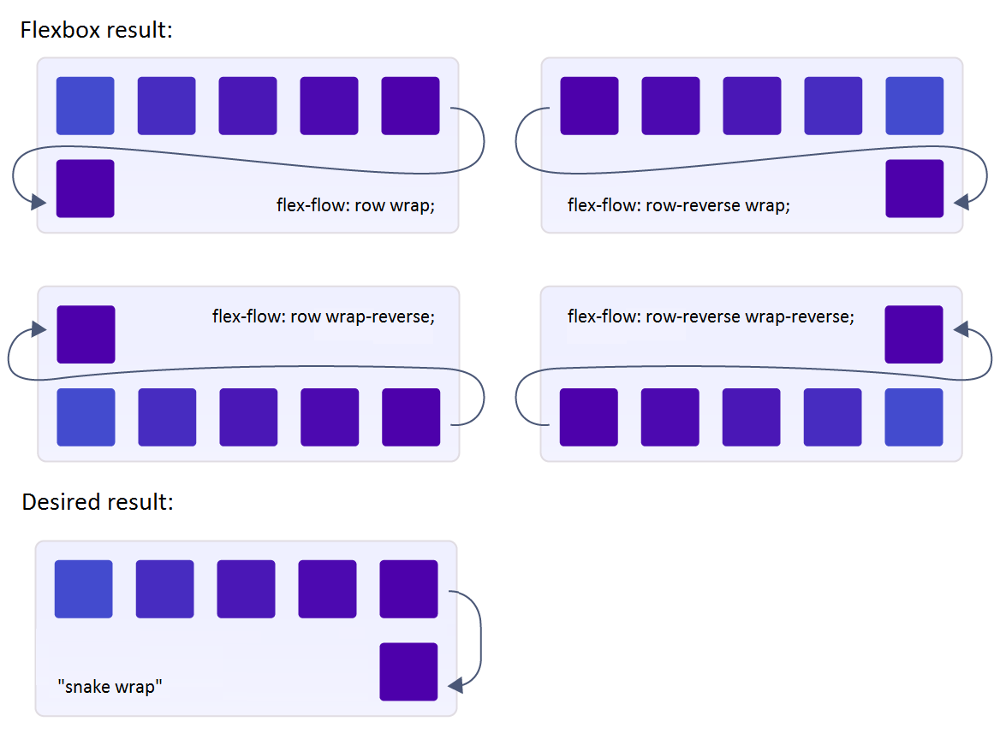

# A CSS FLEX BOX TUTORIAL

In this article we would be discussing the CSS tool known as Flexbox. It is a very essential and helpful tool in designing the web layout of a website. Let's take a look at what this is all about.

### FLEXBOX : 
Flexible box is used to make a container and its items flexible, so there is a lot that can be changed or altered using flexbox as concerns the general layout of a website, it aids responsiveness in a website to a fair degree, what this means is that it helps to have an organized layout even when viewed in smaller screens.

### FLEX:
 When a display property is set to flex, it makes the container and the items contained in it flexible so they can be moved around easily. To get started you must set the display property of your container as flex, if not none of the following properties discussed below will take effect.

### FLEX-CONTAINER:  
This is the container that is being assigned the display property of flex and whatever it houses takes up the property as well and becomes flexible.
The flex-container properties include:

#### Flex-direction: 
This property tells the flex-container which direction to place the items contained in a it. directing them to be placed horizontally or vertically. So ordinarily, it would all go in a row because that is the default property of flexbox but using this property you can alter that and move things around your way!
This can basically go four ways and they are listed below

* Row: This directs the items to be placed horizontally from left to right.
* Row-reverse: This directs items to be placed horizontally from right to left.
* Column: This directs items to be placed vertically from top to bottom
* Column-reverse: this directs items to be placed vertically from bottom to top.

  *A pictorial representation of the properties discussed above*

### Flex-wrap:
 Flexbox is designed to try to fit in all items in one line, this is where the property flexwrap comes in handy cos it is used to makes items go into other lines from top to bottom. This can happen in three ways namely:
* Wrap: This directs items in a flex container to go onto other lines from top to bottom
* Wrap-reverse: This directs items in a flex container to go onto other lines from bottom to top
* No wrap: This is the default feature that flexbox possesses where it tries to fit in everything in one line unless directed to do otherwise.

    *A pictorial representation of flexwrap*
 
 #### Flex-flow:
  This embodies two flex properties; the flex-direction and the flex-wrap properties and these two define the horizontal and vertical axes in a website. The default flexbox property would be row no-wrap but you can change these two properties using this one shorthand property. So you can have:
* Row wrap: This lets the container be placed horizontally while moving the items contained in it onto multiple lines.
* Row nowrap: This allows the container be placed horizontally while fixing items contained in it in one line.
* Column wrap: This lets the container be placed vertically while fixing items contained in it onto multiple lines.
* Column nowrap: This lets the container be placed vertically while fixing items contained in it onto multiple lines.

#### Justify-content: 
This property defines the way contents of the flex container are placed in the horizontal axis. We have the following:

* Flex-start: This places items towards the beginning of the flex-direction.

* Flex-end: This places items towards the end of the flex-direction.
* Start: This places items toward the start of the writing-mode direction.
* End: This places items toward the end of the writing-mode direction.
* Left: This makes item be placed toward the left edge of the container, unless that doesn't make sense with the flex-direction, then it behaves like start.
* Right: This makes items be placed toward the right edge of the container, unless that doesn't make sense with the flex-direction, then it behaves like start.
* Center: This places items in the center of the line.
* Space-between: This distributes items evenly, the first item is on the start line, last item on the end line.
* Space-around: Items are evenly distributed evenly in the line with equal spaces around them.
* Space-evenly: Items are distributed so that the spacing between any two items and the space to the edges is equal.

*A pictorial representation of justify-content*
#### Align-Items:
 This directs how a flex container is placed in the vertical axis of a web layout perpendicular to the horizontal axis. The different ways a flex-container can be aligned include:

#### Stretch:  
 This  is the default property of a flexbox, it just stretches  to fill the container bu  this is  still  with  respect  to  min-width/max-width.
#### Flex-start/start/self-start: 
 Items  are placed at the start of the cross axis. The difference between   is not significant as it is  about respecting the flex-direction rules  or the writing-module rules.

Flex-end/end/self-end:  
 Items  are placed at the end of the cross axis. The difference again is not  significant as it  is about respecting flex-direction rules  vs. writing module rules.

Center:  
Items  are placed  in the  center of  the vertical-axis.

Baseline: 
 Items  are placed  in a way  such that  their baselines align.

*A pictorial representation of Align-items* 

Align-Content:

 Modifies the behavior of the flex-wrap property and aligns the flex container's lines when there is extra space in the vertical axis of the web layout. This is similar to align-items, but instead of aligning flex items, it aligns flex lines instead, it doesn't work when there is only one line of flex items. It possesses the following properties;

* Flex-start/start:  
Items  are  placed at  the start of the container. The flex-start honors  the flex-direction while start honors  the writing mode direction.

* Flex-end/end:  
Items  are  placed at  the end of the container. The flex-end honors  the flex-direction while  end honors the writing-mode direction.

* Center: 
 Items  are  placed at the  center of  the container.

* Space-between:  
Items  are  evenly distributed; the first line is at the start of the container  while the last one is at the end.
* Space-around:  Items  are  evenly  distributed with equal space around each line.

* Space-evenly:  Items  are evenly distributed with equal space around them.
* Stretch:  This  is the default layout. Lines  stretch to take up the remaining space.

FLEX ITEM PROPERTIES

Order: The order property specifies the order of the flex items, the value must be a number and the default is 0.

Flex-Shrink: The flex-shrink property specifies how much a flex item will shrink in relation to the rest of the flex items. The value must be a number and the default is 1.

Flex-Basis: The flex-basis property specifies the initial length of a flex item.

Align-Self: The align-self property specifies the alignment for the selected item inside the flexible container. The align-self property overrides the default alignment set by the container's align-items property.

Flex-Grow: The flex-grow property specifies how much a flex item will grow in relation to the rest of the flex items.

